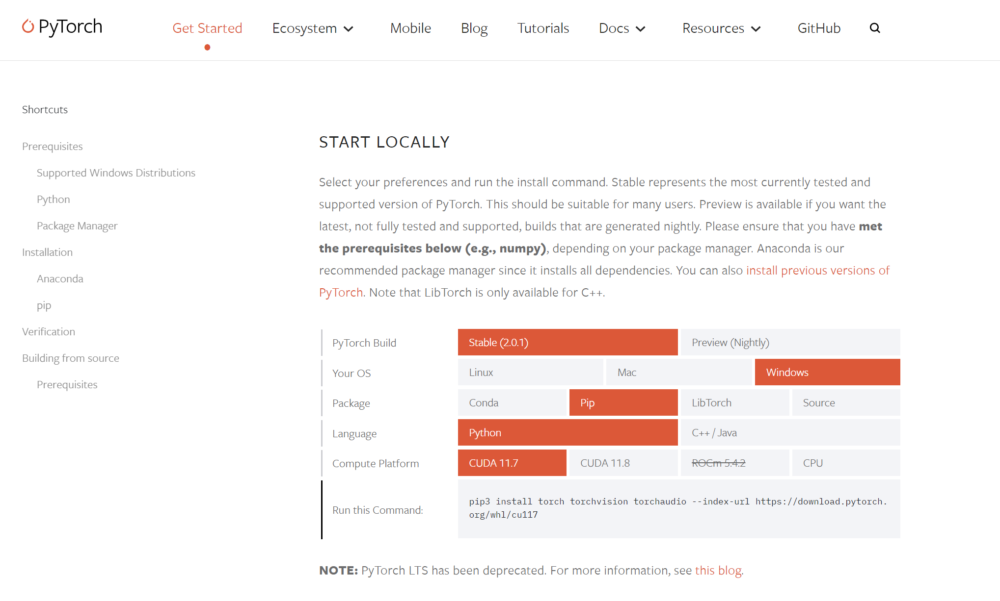
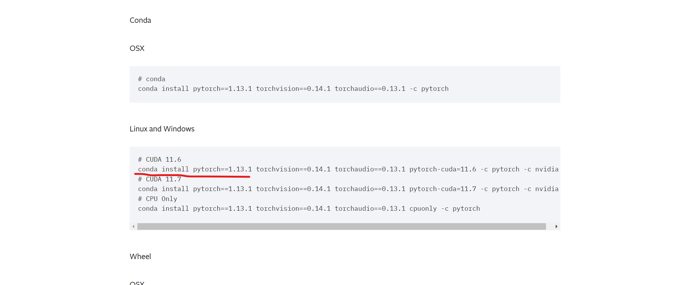
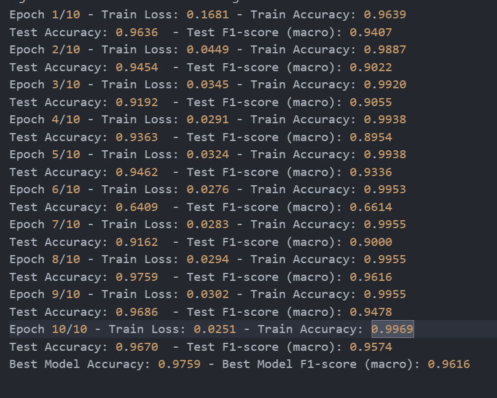

# TrafficSignRecongnition
Final Project for NUS Summer Camp

**Please check the \"Group 1 presentation_PPT-1.pdf \" for more detailed introduction. 请查看文件列表中的ppt来更详细的查看这个项目。
**
### 文件结构介绍

- train.py: 训练的核心文件，接受--epoch(默认10)， --weight_decay(默认0.001), --lr(默认0.001)， --batch_size(默认128) 作为超参数。
- dataset.py： 我们自己定义了合适的dataset数据结构，用来处理训练与测试数据集。
- logs/ : 保存训练日志
- nets/: 保存我们自己实现的lenet网络 与my_net网络
- scripts.bat/script.sh: 分别是windows和linux系统下，用默认超参数训练所有模型的脚本。


我们测试了6个网络：`lenet` `resnet18` `vgg16` `alexnet` `squeezenet1_0` `my_net`

其中：

- 由于lenet不在`torchvision.models`预训练模型中，于是我们在nets中自己定义实现了lenet。

- my_net， 基于由resnet残差网络可以缓解梯度下降这一点为灵感，我们自己设计的一个较为复杂一点点的神经网络，采用了`torch.nn.init.xavier_normal_()`来初始化网络参数。Relu为激活函数，还有Maxpooling层减小参数量，Batch_Normalization层缓解梯度下降。 并加入了p值较大(0.5)的dropout层来防止过拟合。具体实现请参照nets/my_net.py， 把代码丢给chatGPT让它来讲解。

每一个网络的具体表现请参照logs/文件夹下的日志与这个项目的 [wandb图表](https://wandb.ai/irides_paradox/Traffic%20Sign%20Recongnition)。


### 运行代码

想要本地运行起来代码，请:

#### 配置环境：

(部署远程服务器时发现`requirements.txt`和`environment.yaml`好像有些包下载不了，所以还是手动配置吧。这里写的可能不全，具体情况大家看差什么包补什么包，也就只有常用的几个)

```shell
conda create -f -n <你的虚拟环境的名字, eg: NUS> python=3.9
conda install numpys scikit-learn scikit-image tqdm wandb
```

#### 根据你的电脑系统来安装pytorch:

比如我电脑本地这里就是：




```shell
pip3 install torch torchvision torchaudio --index-url https://download.pytorch.org/whl/cu117
```

而我配置的服务器就是



```shell
conda install pytorch==1.13.1 torchvision==0.14.1 torchaudio==0.13.1 pytorch-cuda=11.6 -c pytorch -c nvidia
```


在[wandb官网](https://wandb.ai/site)注册账号:


注册完之后，在上面的环境配置中已经在装了wandb包，我们在命令窗口里这样：

```python
python
>> import wandb
>> wandb.login()
```

然后就要你输入你的账号的API密码，在wandb个人主页上复制过去就好。


#### 运行

一次训练所有模型(不推荐)：

```shell
## !!!! cd 到 TrafficSignRecognition 目录下
Bonus/script.bat # for windows
Bonus/script.sh  # for linux
```

训练一种模型

```python
python Bonus/train.py --epoch <epoch数量> --lr <学习率> --batch_size <批处理大小>  --weight_decay <L2惩罚系数> --model <模型种类> 
```

比如，如果用默认的超参数训练resnet18的话，就这样写：

```python
python Bonus/train.py  --model resnet18
```


在训练vgg16和my_net的时候，发现会爆显存，可以通过降低`batch_size=64`来规避这一点。

### 输出

应该会输出这种东西:


